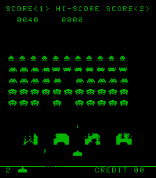
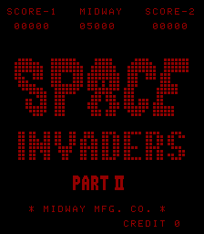
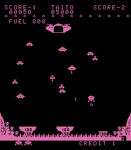
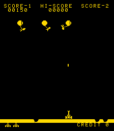

### Introduction

This demo project shows how to make use of the [meen](http://github.com/nbeddows/mach-emu/) and [meen_hw](http://github.com/nbeddows/meen-hw) packages to emulate an arcade machine, in this case, one based on the Space Invaders Taito/Midway arcade hardware. I don't consider the emulation to be the most efficient, accurate, or to be extensively tested, but I'm happy with where it is at.

This project has been tested against the following roms (which can be found elsewhere online) on the following platforms: Windows/Linux(x86_64), Linux(armv7hf, armv8), Pico RP2040(armv6-m):

- Space Invaders.
- Space Invaders Part II/Deluxe.
- Balloon Bomber (This one looks to have issues which go beyond the superficial that require further investigation).
- Lunar Rescue.

For supported desktop platforms The Simple Direct MediaLayer (SDL) is used to render the output and requires a keyboard for interaction (keyboard controls are documented towards the end of this document).
For supported embedded platforms an st7789 based lcd screen is requried for rendering the output (tested with 320x240) with a minimum of 4 buttons for interaction (button controls are documented towards the end of this document).

### Compilation

This project uses [CMake (minimum version 3.23)](https://cmake.org/) for its build system and [Conan (minimum version 2.0)](https://conan.io/) for it's dependency package management. Supported compilers are GCC (minimum version 12), MSVC(minimum version 16).

#### Pre-requisites

##### Linux

- [Install Conan](https://conan.io/downloads/).
- `sudo apt install cmake`.
- cross compilation:
  - armv7hf:
    - `sudo apt install gcc-arm-linux-gnueabihf g++-arm-linux-gnueabihf`.
  - aarch64:
    - `sudo apt install gcc-aarch64-linux-gnu g++-aarch64-linux-gnu`.
  - rp2040:
    - `sudo apt install gcc-arm-none-eabi libnewlib-arm-none-eabi build-essential libstdc++-arm-none-eabi-newlib`. # Needs to be installed for the 2.x SDK (for picotool) - libusb-1.0-0-dev`.
    - `git clone https://github.com/raspberrypi/pico-sdk.git --branch 1.5.1`
    - `cd pico-sdk`
    - `git submodule update --init`
    - build the Raspberry Pi Pico SDK:
      - Conan and the Raspberry Pi Pico Sdk seem to have an issue with conflicting use of the cmake toolchain file
        which results in test programs not being able to be compiled during the conan build process as outlined [here](https://github.com/raspberrypi/pico-sdk/issues/1693).
        At this point we need to build the sdk so that we have the required tools pre-built so the Conan build process will succeed:
        - `mkdir build` 
           **NOTE**: Conan will assume that the build tools are located in the `build` directory, **do not** use a different directory name.
        - `cd build`
        - `cmake ..`
        - `make`
    - Set the Raspberry Pi Pico SDK Path:
        -`export PICO_SDK_PATH=${PATH_TO_PICO_SDK}`
        To avoid having to export it on every session, add it to the end of your .bashrc file instead:
        - `nano ~/.bashrc`
        - `export PICO_SDK_PATH=${PATH_TO_PICO_SDK}`
	- save, close and re-open shell.

##### Windows

- [Install Conan](https://conan.io/downloads).
- [Install CMake](https://cmake.org/download/).

**1.** Install the supported meen conan configurations (v0.1.0) (if not done so already):
- `conan config install -sf profiles -tf profiles https://github.com/nbeddows/meen-conan-config.git --args "--branch v0.1.0"`

**2.** Install dependencies:
- Windows msvc x86_64 build and host: `conan install . --build=missing --profile:build=Windows-x86_64-msvc-193 --profile:host=profiles/Windows-x86_64-msvc-193-sdl`.
- Linux x86_64 build and host: `conan install . --build=missing --profile:build=Linux-x86_64-gcc-13 --profile:host=profiles/Linux-x86_64-gcc-13-sdl`.
- Linux x86_64 build, Linux armv7hf host: `conan install . --build=missing -profile:build=Linux-x86_64-gcc-13 -profile:host=profiles/Linux-armv7hf-gcc-13-sdl`.
- Linux x86_64 build, Linux armv8 host: `conan install . --build=missing -profile:build=Linux-x86_64-gcc-13 -profile:host=profiles/Linux-armv8-gcc-13-sdl`.
- Linux x86_64 build, RP2040 microcontroller (baremetal armv6-m) host: `conan install . --build=missing -profile:build=Linux-x86_64-gcc-13 -profile:host=profiles/rp2040-armv6-gcc-13-st7789vw`. 

**NOTE**: when performing a cross compile using a host profile you must install the requisite toolchain of the target architecture, [see pre-requisites](#pre-requisites).

**NOTE**: under Linux with an sdl host profile errors similar to the following, `ERROR: xorg/system: Error in system_requirements() method` require additional package installations as denoted by the above console messages: "`dpkg-query: no packages found matching ${pkg0}`": `sudo apt install ${pkg0} ${pkg1} ${pkgn}`.
When cross compiling for arm you may need to add the arm development repositories to your apt sources if the packages previously installed could not be found, for example (at the time of writing):
- Pre Ubuntu Noble:
  - `sudo nano /etc/apt/source.list`
  - Append the following:
      - deb [arch=arm64] http://ports.ubuntu.com/ lunar main multiverse universe
      - deb [arch=arm64] http://ports.ubuntu.com/ lunar-security main multiverse universe
      - deb [arch=arm64] http://ports.ubuntu.com/ lunar-backports main multiverse universe
      - deb [arch=arm64] http://ports.ubuntu.com/ lunar-updates main multiverse universe
- Ubuntu Noble onwards:
  - `sudo nano /etc/apt/sources.list.d/ubuntu.sources
  - Append the following:
      Types: deb
      URIs: http://ports.ubuntu.com/
      Suites: noble
      Architectures: arm64
      Components: main multiverse universe
      Signed-By: /usr/share/keyrings/ubuntu-archive-keyring.gpg

      Types: deb
      URIs: http://ports.ubuntu.com/
      Suites: noble-security
      Architectures: arm64
      Components: main multiverse universe
      Signed-By: /usr/share/keyrings/ubuntu-archive-keyring.gpg

      Types: deb
      URIs: http://ports.ubuntu.com/
      Suites: noble-backports
      Components: main multiverse universe
      Signed-By: /usr/share/keyrings/ubuntu-archive-keyring.gpg

      Types: deb
      URIs: http://ports.ubuntu.com/
      Suites: noble-updates
      Architectures: arm64
      Components: main multiverse universe
      Signed-By: /usr/share/keyrings/ubuntu-archive-keyring.gpg
- Save and exit
- `sudo dpkg --add-architecture arm64`
- `sudo dpkg --print-foreign-architectures`
- `sudo apt-get update`
- Reinstall the missing packages.

The following dependent packages will be (compiled if required and) installed:

- mach_emu ^
- meen_hw ^
- ArduinoJson
- popl
- sdl
- sdl_mixer

^ These packages are not currently hosted on a Conan server and require manual installation, see the section titled [Export a Conan package](https://github.com/nbeddows/mach-emu/blob/main/README.md).
**NOTE**: mach_emu minimum version of 2.0.0 is required for rp2040 support which is currently under development and therefore must be installed from the mach_emu development branch.

**3.** Run cmake to configure and generate the build system.

- Multi configuration generators (MSVC for example): `cmake --preset conan-default [-Wno-dev]`.
- Single configuration generators (make for example): `cmake --preset conan-release [-Wno-dev]`.

**4.** Run cmake to compile i8080-arcade: `cmake --build --preset conan-release`.

**5.** Run i8080-arcade:

**Linux/Windows (x86_64)**:
- `build\generators\conanrun.[bat|sh]`: export the dependent shared library paths.
- `artifacts/Release/x86_64/bin/i8080-arcade`.
- `build\generators\deactivate_conanrun.[bat|sh]`: restore the environment.

**Linux (armv7hf, armv8)**:

When running a cross compiled build the binaries need to be uploaded to the host machine before they can be executed.
1. Create an Arm Linux binary distribution: See building a binary package. 
2. Copy the distribution to the arm machine: `scp build/Release/Sdk/i8080-arcade-v0.6.0-Linux-armv7hf-bin.tar.gz ${user}@raspberrypi:i8080-arcade-v0.6.0.tar.gz`.
3. Ssh into the arm machine: `ssh ${user}@raspberrypi`.
4. Extract the i8080-arcade archive copied over via scp: `tar -xzf i8080-arcade-v0.6.0.tar.gz`.
5. Change directory to i8080-arcade `cd i8080-arcade`.
6. Run i8080-arcade: `./run-i8080-arcade.sh`. 

**RP2040 (armv6)**:

This has been tested successfully using a 2 inch 320x240 lcd using the st7789 driver. 
Before uploading the UF2 image to the pico board ensure that your lcd is connected correctly.

When running a cross compiled build the binaries need to be uploaded to the host machine before they can be executed.
This example will assume you are deploying the UF2 file from a Raspberry Pi.
1. Create an Arm Linux binary distribution: see building a binary development package.
2. Copy the distribution to the arm machine: `scp build/Release/i8080-arcade-v0.7.0-baremetal-armv6-GNU-13.2.1.tar.gz ${user}@raspberrypi:i8080-arcade-v0.7.0.tar.gz`.
3. Ssh into the arm machine: `ssh ${user}@raspberrypi`.
4. Extract the i8080-arcade archive copied over via scp: `tar -xzf i8080-arcade-v0.7.0.tar.gz`.
5. Hold down the `bootsel` button on the pico and plug in the usb cable into the usb port of the Raspberry Pi then release the `bootsel` button.
6. Echo the attached `/dev` device (this should show up as `sdb1` for example): `dmesg | tail`.
7. Create a mount point (if not done already): `sudo mkdir /mnt/pico`.
8. Mount the device: `sudo mount /dev/sdb1 /mnt/pico`. Run `ls /mnt/pico` to confirm it mounted.
9. Copy the uf2 image to the pico: `cp i8080-arcade-v0.7.0-baremetal-armv6-GNU-13.2.1/bin/i8080_arcade.uf2 /mnt/pico`
10. You should see a new device `ttyACM0`: `ls /dev` to confirm.
11. Unmount the device: `sudo umount /mnt/pico`.

Once the UF2 image has been uploaded the Space Invaders rom should start running on the display.

The following command line options are available (not available for embedded targets, rp2040 for example):

- `-h, --help`: display a help message listing all available command line options.
- `-c, --config-file`: the configuration file to load (default: conf/config.json).
- `-r, --rom-file-path`: the path to the rom files directory (default: rom-files).
- `-a, --audio-file-path`: the path to the audio samples directory (default: audio-files).
- `-s, --save-file-path`: the path to the save files directory (default: save-files).
- `-g, --game`: the name of the i8080 arcade game to load as defined in the config file (default: space-invaders).

#### Building a binary package

A standalone binary package can be built via the `package` target that can be distributed and installed:

- `cmake --build --preset conan-release --target=package`

This will also create doxygen generated documentation (todo) and perform static analysis.

The `package` target as defined by the install targets in the root CMakeLists.txt will build a tar gzipped package which can be replicated by the following cpack command:
- `cpack --config build\CPackConfig.cmake -C ${build_type} -G TGZ`

The underlying package generator used to build the package (in this case `tar`) must be installed otherwise this command will fail.

**NOTE**: the `-G` option can be specifed to overwrite the default `TGZ` cpack generator if a different packaging method is desired:

- `cpack --config build\CPackConfig.cmake -C ${build_type} -G ZIP`

This will build a binary package using the `zip` utility.

Run `cpack --help` for a list available generators.

The final package can be stripped by running the i8080-arcade-strip-pkg target (defined only for platforms that support strip):
- `cmake --build --preset conan-release --target=i8080-arcade-strip-pkg`.

### Configuration

A configuration file targeting the i8080 arcade hardware is provided in json format. It is designed for flexibility and verbosity.

It is divided into two main sections:

#### Hardware

These options should be fixed to the specfied values unless stated otherwise.

##### MachEmu

The current settings for these options should be sufficient, changing them may have a negative impact on performance.

`clockResolution:1000000000 / 60 / 2` - i8080 arcade hardware runs at 60Hz with 2 interrupts per frame, set the machine clock resolution accordingly. 
`isrFreq:0.9` - We require 4 interrupts, 2 for i8080-arcade and 2 machine level interrupts for loading and saving. Ideally we would lock the interrupt service routine frequency to the clock resolution ("isrFreq":1), however, we need to spare some time for checking for load and save requests, so we bump the isrFreq down by ten percent ("isrFreq":0.9). One could lower it further, this would make it more responsive (0.9 should be good enough). Increasing it above 1 would make it slower and not respond to load/save requests. 
`loadAsync:true` - Load the machine state asynchronously.  
`runAsync:true` - Run the machine asynchronously from the io. 
`saveAsync:true` - Save the machine state asynchronously. 

**NOTE**: the RP IO Controller does not support saving (`saveAsync`) or loading (`loadAsync`) state.

##### Video

Video hardware options. These options can be changed for the desired output.

`width:224` - The width of the screen. For non embedded platforms, the output will scale to fit. For embedded platforms, the value should be the width of your attached lcd panel 
`height:256` - The height of the screen. For non embedded platforms, the output will scale to fit. For embedded platforms, the value should be the width of your attached lcd panel 
`full-screen:false` - Window or full screen display. (Experimental) 

**NOTE**: the RP IO Controller does not support scaling or full-screen, the width and height parameters will be used to center the output on the display device.

##### Audio

Audio hardware options. The current settings for these options should be sufficient.

`channels:1` - The number of audio output channels. 
`sample-rate:11025` - The audio output sample rate. 
`sample-size:512` - The audio output sample size. 

**NOTE**: these options can be changed if using custom audio samples.
**NOTE**: the RP IO Controller does not support audio, these options have no affect.

#### Software

These settings apply to the various arcade roms that can be loaded.

##### Video

These settings affect visual output and can be changed. They apply to all game roms loaded.

`bpp:8` - Bits per pixel, supported values are 1 (experimental and not universally supported), 8 (rgb332) and 16 (rgb565). 
`colour:white`: the forground colour (the background is always black), supported values are "white", "red", "green", "blue", "random" and a 16 bit custom hex value. 
`orientation:upright` - The window layout, "cocktail" for horizontal and "upright" for vertical. 

**NOTE**: the RP IO Controller only supports cocktail orientation @ 16bpp.

##### Audio

These settings affect audio output. They can be changed if different audio samples are desired. They apply to all game roms loaded.

`audio:file` - The name of the audio sample to load (empty entries are ignored and **must** not be removed). 

**NOTE**: the position of the audio files in the array **must** not be changed. 
**NOTE**: if changing the audio files, the audio hardware properties may need to be updated (untested).
**NOTE**: the RP IO Controller does not support audio, these setting have no affect.

##### Space Invaders/Space Invaders Deluxe/Space Invaders II/Balloon Bomber/Lunar Rescue

These settings are fixed to the specified rom and should not be changed.

`memory:rom:file:name` - The name of the rom file. 
`memory:rom:file:offset` - The start of memory rom load offset. 
`memory:rom:file:size` - The rom file size. 
`memory:ram:block:offset` - The start of memory ram block offset. 
`memory:ram:block:size` - The ram block size. 

**NOTE**: the RP IO Controller does not support saving or loading, hence these settiings will have no affect.

### Desktop Keyboard Controls

`q`: Quit 
`c`: Credit 
`1`: 1P 
`2`: 2P 
`a`: 1P left 
`s`: 1P fire 
`d`: 1P right 
`3`: 3 ships 
`4`: 4 ships 
`5`: 5 ships 
`6`: 6 ships 
`t`: Tilt 
`e`: Extra ship at 
`j`: 2P left 
`k`: 2P fire 
`l`: 2P right 
`i`: Show coin info 
`y`: Save game 
`r`: Load game  

### Embedded button controls

Four buttons can be used to control a one player emulation. All game settings will be at defaults, this includes starting with 3 ships with an addtional
ship every 1500 points.

More buttons and/or logic can be added for a more complete emulation, 2 player support for example (keeping it simple for demonstration purposes).

The pin layout used is the same as the [hardware lcd](https://www.waveshare.com/wiki/Pico-LCD-2) used for testing.

`button 0`: when on the rom attraction screen, select the previous rom in the list of supported roms, when in gameplay mode, move the ship to the left.
`button 1`: when on the rom attraction screen, add a credit and start a single player game, when in gameplay mode, quit and return to the attraction screen.
`button 2`: when in gameplay mode, fire at the enemy.
`button 3`: when on the rom attraction screen, select the next rom in the list of supported roms, when in gameplay mode, move the ship to the right.

   

### Acknowledgements

Special thanks to the following sites:

[brentradio](http://www.brentradio.com/SpaceInvaders.htm) 
[computerarcheology](https://computerarcheology.com/Arcade/SpaceInvaders/Hardware.html) 
