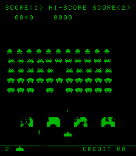

### Introduction

This demo project shows how to make use of the [mach-emu sdk](http://github.com/nbeddows/mach-emu/) and [meen_hw](http://github.com/nbeddows/meen-hw) to emulate an arcade machine, in this case, Space Invaders. I don't consider the emulation to be the most efficient or accurate, but I'm happy with where it is at.

### Compilation

This project uses [CMake (minimum version 3.23)](https://cmake.org/) for its build system and [Conan (minimum version 2.0)](https://conan.io/) for it's dependency package management. Supported compilers are GCC (minimum version 12), MSVC(minimum version 16) and Clang (minimum version 16).

#### Pre-requisites

##### Linux

- [Install Conan](https://conan.io/downloads/).
- `sudo apt install cmake`.
- `sudo apt install gcc-arm-linux-gnueabihf` (if cross compiling for armv7hf).
- `sudo apt install gcc-aarch64-linux-gnu` (if cross compiling for aarch64).
- `sudo apt install g++-aarch64-linux-gnu` (if cross compiling for aarch64).

##### Windows

- [Install Conan](https://conan.io/downloads).
- [Install CMake](https://cmake.org/download/).

**1.** Create a default profile (if you have no profiles): `conan profile detect`. This will detect the operating system, build architecture, compiler settings and set the build configuration as Release by default. The profile will be named `default` and will reside in $HOME/.conan2/profiles. 

**2.** Install dependencies:
- Using the default build and host profiles: `conan install . --build=missing`.
- Using the default build profile targeting 32 bit Raspberry Pi OS: `conan install . --build=missing -pr:h=profiles/raspberry-32`. 
- Using the default build profile targeting 64 bit Raspberry Pi OS: `conan install . --build=missing -pr:h=profiles/raspberry-64`. 

**NOTE**: raspberry host profiles can be obtained from the [mach-emu project](https://github.com/nbeddows/mach-emu/tree/main/profiles).

**NOTE**: when performing a cross compile using a host profile you must install the requisite toolchain of the target architecture, [see pre-requisites](#pre-requisites).

**NOTE**: under Linux errors similar to the following, `ERROR: xorg/system: Error in system_requirements() method` require additional package installations as denoted by the above console messages: "`dpkg-query: no packages found matching ${pkg0}`": `sudo apt install ${pkg0} ${pkg1} ${pkgn}`.
When cross compiling for arm you may need to add the arm development repositories to your apt sources if the packages previously installed could not be found, for example:
- `sudo nano /etc/apt/source.list`
- Append the following:
    - deb [arch=arm64] http://ports.ubuntu.com/ lunar main multiverse universe
    - deb [arch=arm64] http://ports.ubuntu.com/ lunar-security main multiverse universe
    - deb [arch=arm64] http://ports.ubuntu.com/ lunar-backports main multiverse universe
    - deb [arch=arm64] http://ports.ubuntu.com/ lunar-updates main multiverse universe
- Save and exit
- `sudo dpkg --add-architecture arm64`
- `sudo dpkg --print-foreign-architectures`
- `sudo apt-get update`
- Reinstall the missing packages.

The following dependent packages will be (compiled if required and) installed:

- mach_emu
- meen_hw
- nlohmann_json
- popl
- sdl
- sdl_mixer

**3.** Run cmake to configure and generate the build system.

- Multi configuration generators (MSVC for example): `cmake --preset conan-default [-Wno-dev]`.
- Single configuration generators (make for example): `cmake --preset conan-release [-Wno-dev]`.

**4.** Run cmake to compile Space Invaders: `cmake --build --preset conan-release`.

**5.** Run Space Invaders:

**Linux/Windows (x86_64)**:
- `build\generators\conanrun.bat/sh`: export the dependent shared library paths.
- `artifacts/Release/x86_64/bin/space-invaders`.
- `build\generators\deactivate_conanrun.bat/sh`: restore the environment.

**Linux (armv7hf, armv8)**:

When running a cross compiled build the binaries need to be uploaded to the host machine before they can be executed.
1. Create an Arm Linux binary distribution: See building a binary package. 
2. Copy the distribution to the arm machine: `scp build/Release/Sdk/space-invaders-v0.5.0-Linux-armv7hf-bin.tar.gz ${user}@raspberrypi:space-invaders-v0.5.0.tar.gz`.
3. Ssh into the arm machine: `ssh ${user}@raspberrypi`.
4. Extract the space-invaders archive copied over via scp: `tar -xzf space-invaders-v0.5.0.tar.gz`.
5. Change directory to space-invaders `cd space-invaders`.
6. Run Space Invaders: `./run-space-invaders.sh`. 

The following command line options are available:

- `-h, --help`: display a help message listing all available command line options.
- `-c, --config-file`: the configuration file to load (default: conf/config.json).
- `-r, --rom-file-path`: the path to the rom files directory (default: rom-files).
- `-a, --audio-file-path`: the path to the audio samples directory (default: audio-files).
- `-s, --save-file-path`: the path to the save files directory (default: save-files).
- `-g, --game`: the name of the i8080 arcade game to load as defined in the config file (default: space-invaders).

#### Building a binary package

A standalone binary package can be built via CPack that can be distributed and installed.

- `cpack --config build\CPackConfig.cmake`

This will build a package using the default generator.
The underlying package generator used to build the package must be installed otherwise this command will fail.

NOTE: the `-G` option can be specifed to overwrite the default cpack generator.

- `cpack --config build\CPackConfig.cmake -G ZIP`

This will build a binary package using the zip utility.

Run `cpack --help` for a list available generators.

### Configuration

A configuration file targeting the i8080 arcade hardware is provided in json format. It is desinged for flexibility and verbosity. It is divided into two main sections:

#### Hardware

These options should be fixed to the specfied values unless stated otherwise.

##### MachEmu

The current settings for these options should be sufficient, changing them may have a negative impact on performance.

`clockResolution:1000000000 / 60 / 2` - i8080 arcade hardware runs at 60Hz with 2 interrupts per frame, set the machine clock resolution accordingly. 
`isrFreq:0.9` - We require 4 interrupts, 2 for Space Invaders and 2 machine level interrupts for loading and saving. Ideally we would lock the interrupt service routine frequency to the clock resolution ("isrFreq":1), however, we need to spare some time for checking for load and save requests, so we bump the isrFreq down by ten percent ("isrFreq":0.9). One could lower it further, this would make it more responsive (0.9 should be good enough). Increasing it above 1 would make it slower and not respond to load/save requests. 
`loadAsync:true` - Load the machine state asynchronously.  
`runAsync:true` - Run the machine asynchronously from the io. 
`saveAsync:true` - Save the machine state asynchronously. 

##### Video

Video hardware options. These options can be changed for the desired output.

`width:224` - The width of the screen. 
`height:256` - The height of the screen. 
`full-screen:false` - Window or full screen display. 

##### Audio

Audio hardware options. The current settings for these options should be sufficient.

`channels:1` - The number of audio output channels. 
`sample-rate:11025` - The audio output sample rate. 
`sample-size:512` - The audio output sample size. 

**NOTE**: these options can be changed if using custom audio samples.

#### Software

These settings apply to the various arcade roms that can be loaded.

##### Video

These settings affect visual output and can be changed. They apply to all game roms loaded.

`bpp:8` - Bits per pixel, supported values are 1 (currently not supported via the SDL IO controller) and 8. 
`colour:white`: the forground colour (the background is always black), supported values are "white", "red", "green", "blue", "random" and an 8 bit custom hex value. 
`orientation:upright` - The window layout, "cocktail" for horizontal and "upright" for vertical. 

##### Audio

These settings affect audio output. They can be changed if different audio samples are desired. They apply to all game roms loaded.

`audio:file` - The name of the audio sample to load (empty entries are ignored and **must** not be removed). 

**NOTE**: the position of the audio files in the array **must** not be changed. 
**NOTE**: if changing the audio files, the audio hardware properties may need to be updated (untested).

##### Space Invaders/Space Invaders Deluxe/Balloon Bomber/Lunar Rescue

These settings are fixed to the specified rom and should not be changed.

`memory:rom:file:name` - The name of the rom file. 
`memory:rom:file:offset` - The start of memory rom load offset. 
`memory:rom:file:size` - The rom file size. 
`memory:ram:block:offset` - The start of memory ram block offset. 
`memory:ram:block:size` - The ram block size. 

### Keyboard Controls

`q`: Quit 
`c`: Credit 
`1`, 1P 
`2`: 2P 
`a`: 1P Left 
`s`: 1P Fire 
`d`: 1P Right 
`3`: 3 Ships 
`4`: 4 Ships 
`5`: 5 Ships 
`6`: 6 Ships 
`t`: Tilt 
`e`: Extra ship at 
`j`: 2P Left 
`k`: 2P Fire 
`l`: 2P Right 
`i`: Show coin info 

### Acknowledgements

Special thanks to the following sites:

[brentradio](http://www.brentradio.com/SpaceInvaders.htm) 
[computerarcheology](https://computerarcheology.com/Arcade/SpaceInvaders/Hardware.html) 
