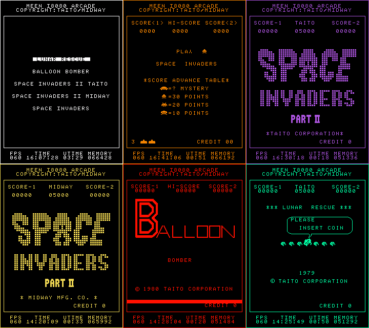

### Introduction

This demo project shows how to make use of the [meen](http://github.com/nbeddows/meen/) and [meen_hw](http://github.com/nbeddows/meen-hw) packages to emulate an arcade machine, in this case, one based on the Space Invaders Taito/Midway arcade hardware.

It adds the following addtional graphical components to the emulation:
- a rom selection screen allowing the user select and load the supported roms (see controls section for further details).  
- title and credits.
- metadata including:
  - frame rate.
  - current time (not supported on RP2040).
  - up time.
  - memory usage (Windows - working set size, RP2040 - mallinfo uordblks, other platforms (where supported) - /proc/self/stat resident set size).

This project has been tested against the following roms (which can be found elsewhere online) with loading/saving game play state on the following platforms: Windows/Linux(x86_64), Linux(armv7hf, armv8), Pico RP2040(armv6-m) (load only):

| Rom                             | Remarks                                                                       |
|:--------------------------------|:------------------------------------------------------------------------------|
| Space Invaders                  | Passes general gameplay testing                                               |
| Space Invaders Part II (Midway) | Passes general gameplay testing                                               |
| Space Invaders Part II (Taito)  | Passes general gameplay testing                                               |
| Balloon Bomber                  | Has issues which go beyond the superficial that require further investigation |
| Lunar Rescue                    | Passes general gameplay testing                                               |

For supported desktop platforms The Simple Direct MediaLayer (SDL) is used to render the video and audio and requires a keyboard for interaction (keyboard controls are documented towards the end of this document). 
For supported embedded platforms an st7789 based lcd screen is requried for video rendering (tested with [this lcd](https://www.waveshare.com/wiki/Pico-LCD-2)), for audio rendering, an audio module that can transmit pcm mono 8/16it samples over the I2S bus (tested with [version 1 of this module](https://www.waveshare.com/wiki/Pico-Audio)) and a minimum of 4 buttons for interaction (button controls are documented towards the end of this document).

I don't consider the emulation to be the most efficient, accurate, or to be extensively tested, but I'm happy with where it is at.

### Compilation

This project uses [CMake (minimum version 3.23)](https://cmake.org/) for its build system and [Conan (minimum version 2.0)](https://conan.io/) for it's dependency package management. Supported compilers are GCC (minimum version 12), MSVC(minimum version 16).

#### Pre-requisites

##### Linux

- [Install Conan](https://conan.io/downloads/)
- `sudo apt install cmake`
- `sudo apt install texlive-font-utils`
- cross compilation:
  - armv7hf:
    - `sudo apt install gcc-arm-linux-gnueabihf g++-arm-linux-gnueabihf`
  - aarch64:
    - `sudo apt install gcc-aarch64-linux-gnu g++-aarch64-linux-gnu`
  - rp2040:
    - `sudo apt install gcc-arm-none-eabi libnewlib-arm-none-eabi build-essential libstdc++-arm-none-eabi-newlib`
    - `git clone https://github.com/raspberrypi/pico-sdk.git --branch 1.5.1`
    - `cd pico-sdk`
    - `git submodule update --init`
    - build the Raspberry Pi Pico SDK:
      - Conan and the Raspberry Pi Pico Sdk seem to have an issue with conflicting use of the cmake toolchain file
        which results in test programs not being able to be compiled during the conan build process as outlined [here](https://github.com/raspberrypi/pico-sdk/issues/1693).
        At this point we need to build the sdk so that we have the required tools pre-built so the Conan build process will succeed:
        - `mkdir build` 
           **NOTE**: Conan will assume that the build tools are located in the `build` directory, **do not** use a different directory name.
        - `cd build`
        - `cmake ..`
        - `make`
    - Set the Raspberry Pi Pico SDK Path:
        -`export PICO_SDK_PATH=${PATH_TO_PICO_SDK}`
        To avoid having to export it on every session, add it to the end of your .bashrc file instead:
        - `nano ~/.bashrc`
        - `export PICO_SDK_PATH=${PATH_TO_PICO_SDK}`
	- save, close and re-open shell.

##### Windows

- [Install Conan](https://conan.io/downloads)
- [Install CMake](https://cmake.org/download/)

**1.** Install the supported meen conan configurations (v0.1.0) (if not done so already):
- `conan config install -sf profiles -tf profiles https://github.com/nbeddows/meen-conan-config.git --args "--branch v0.1.0"`

**2.** Install dependencies:
- Windows msvc x86_64 build and host: `conan install . --build=missing --profile:all=profiles/Windows-x86_64-msvc-193-sdl`
- Linux x86_64 build and host: `conan install . --build=missing --profile:all=profiles/Linux-x86_64-gcc-13-sdl`
- Linux x86_64 build, Linux armv7hf host: `conan install . --build=missing --profile:build=Linux-x86_64-gcc-13 --profile:host=profiles/Linux-armv7hf-gcc-13-sdl`
- Linux x86_64 build, Linux armv8 host: `conan install . --build=missing --profile:build=Linux-x86_64-gcc-13 --profile:host=profiles/Linux-armv8-gcc-13-sdl`
- Linux x86_64 build, RP2040 microcontroller (baremetal armv6-m) host: `conan install . --build=missing --profile:build=Linux-x86_64-gcc-13 --profile:host=profiles/rp2040-armv6-gcc-13-st7789vw` 

**NOTE**: when performing a cross compile using a host profile you must install the requisite toolchain of the target architecture, see pre-requisites.

**NOTE**: under Linux with an sdl host profile errors similar to the following, `ERROR: xorg/system: Error in system_requirements() method` require additional package installations as denoted by the above console messages: "`dpkg-query: no packages found matching ${pkg0}`": `sudo apt install ${pkg0} ${pkg1} ${pkgn}`
When cross compiling for arm you may need to add the arm development repositories to your apt sources if the packages previously installed could not be found, for example (at the time of writing):
- Pre Ubuntu Noble:
  - `sudo nano /etc/apt/source.list`
  - Append the following:
      - deb [arch=arm64] http://ports.ubuntu.com/ lunar main multiverse universe
      - deb [arch=arm64] http://ports.ubuntu.com/ lunar-security main multiverse universe
      - deb [arch=arm64] http://ports.ubuntu.com/ lunar-backports main multiverse universe
      - deb [arch=arm64] http://ports.ubuntu.com/ lunar-updates main multiverse universe
- Ubuntu Noble onwards:
  - `sudo nano /etc/apt/sources.list.d/ubuntu.sources
  - Append the following:
      Types: deb
      URIs: http://ports.ubuntu.com/
      Suites: noble
      Architectures: arm64
      Components: main multiverse universe
      Signed-By: /usr/share/keyrings/ubuntu-archive-keyring.gpg

      Types: deb
      URIs: http://ports.ubuntu.com/
      Suites: noble-security
      Architectures: arm64
      Components: main multiverse universe
      Signed-By: /usr/share/keyrings/ubuntu-archive-keyring.gpg

      Types: deb
      URIs: http://ports.ubuntu.com/
      Suites: noble-backports
      Components: main multiverse universe
      Signed-By: /usr/share/keyrings/ubuntu-archive-keyring.gpg

      Types: deb
      URIs: http://ports.ubuntu.com/
      Suites: noble-updates
      Architectures: arm64
      Components: main multiverse universe
      Signed-By: /usr/share/keyrings/ubuntu-archive-keyring.gpg
- Save and exit.
- `sudo dpkg --add-architecture arm64`
- `sudo dpkg --print-foreign-architectures`
- `sudo apt-get update`
- Reinstall the missing packages.

The following dependent packages will be (compiled if required and) installed:

| Package     | Remarks                                                               |
|:------------|:----------------------------------------------------------------------|
| meen        | Machine Emulator ENgine - must be installed manually (see note below) |
| meen_hw     | MEEN Hardware - must be installed manually (see note below)           |
| ArduinoJson | A lightweight json parser                                             |
| sdl         | Simple Direct Media Layer                                             |
| sdl_mixer   | Simple Direct Media Layer Mixer                                       |

**NOTE**: meen and meen_hw are not currently hosted on a Conan server and require manual installation, see the section titled [Export a Conan package](https://github.com/nbeddows/meen/blob/main/README.md). 
**NOTE**: meen minimum version of 2.0.0 is required for RP2040 support.

**3.** Run cmake to configure and generate the build system.

- Multi configuration generators (MSVC for example): `cmake --preset conan-default [-Wno-dev]`
- Single configuration generators (make for example): `cmake --preset conan-release [-Wno-dev]`

**4.** Run cmake to compile i8080-arcade: `cmake --build --preset conan-release`

**5.** Run i8080-arcade:

**Linux/Windows (x86_64)**:
- `build\generators\conanrun.[bat|sh]`: export the dependent shared library paths.
- `artifacts/Release/x86_64/bin/i8080-arcade`
- `build\generators\deactivate_conanrun.[bat|sh]`: restore the environment.

**Linux (armv7hf, armv8)**:

When running a cross compiled build the binaries need to be uploaded to the host machine before they can be executed.
1. Create an Arm Linux binary distribution: See building a binary package. 
2. Copy the distribution to the arm machine: `scp build/Release/Sdk/i8080-arcade-v0.6.0-Linux-armv7hf-bin.tar.gz ${user}@raspberrypi:i8080-arcade-v0.6.0.tar.gz`
3. Ssh into the arm machine: `ssh ${user}@raspberrypi`
4. Extract the i8080-arcade archive copied over via scp: `tar -xzf i8080-arcade-v0.6.0.tar.gz`
5. Change directory to i8080-arcade `cd i8080-arcade`
6. Run i8080-arcade: `./run-i8080-arcade.sh` 

**RP2040 (armv6)**:

This has been tested successfully using a 2 inch 320x240 lcd using the st7789 driver. 
Before uploading the UF2 image to the pico board ensure that your lcd is connected correctly.

When running a cross compiled build the binaries need to be uploaded to the host machine before they can be executed.
This example will assume you are deploying the UF2 file from a Raspberry Pi.
1. Create an Arm Linux binary distribution: see building a binary development package.
2. Copy the distribution to the arm machine: `scp build/Release/i8080-arcade-v0.7.0-baremetal-armv6-GNU-13.2.1.tar.gz ${user}@raspberrypi:i8080-arcade-v0.7.0.tar.gz`
3. Ssh into the arm machine: `ssh ${user}@raspberrypi`
4. Extract the i8080-arcade archive copied over via scp: `tar -xzf i8080-arcade-v0.7.0.tar.gz`.
5. Hold down the `bootsel` button on the pico and plug in the usb cable into the usb port of the Raspberry Pi then release the `bootsel` button.
6. Echo the attached `/dev` device (this should show up as `sdb1` for example): `dmesg | tail`
7. Create a mount point (if not done already): `sudo mkdir /mnt/pico`
8. Mount the device: `sudo mount /dev/sdb1 /mnt/pico`. Run `ls /mnt/pico` to confirm it mounted.
9. Copy the uf2 image to the pico: `cp i8080-arcade-v0.7.0-baremetal-armv6-GNU-13.2.1/bin/i8080_arcade.uf2 /mnt/pico`
10. You should see a new device `ttyACM0`: `ls /dev` to confirm.
11. Unmount the device: `sudo umount /mnt/pico`

Once the UF2 image has been uploaded the Space Invaders rom should start running on the display.

The default path of the configuration file to load is `conf/config.json`. It can be overwritten by a command line argument specifying the new path to the configuration file (not available for embedded targets, rp2040 for example).

#### Building a binary package

A standalone binary package can be built via the `package` target that can be distributed and installed:

- `cmake --build --preset conan-release --target=package`

This will also create doxygen generated documentation (todo) and perform static analysis.

The `package` target as defined by the install targets in the root CMakeLists.txt will build a tar gzipped package which can be replicated by the following cpack command:
- `cpack --config build\CPackConfig.cmake -C ${build_type} -G TGZ`

The underlying package generator used to build the package (in this case `tar`) must be installed otherwise this command will fail.

**NOTE**: the `-G` option can be specifed to overwrite the default `TGZ` cpack generator if a different packaging method is desired:

- `cpack --config build\CPackConfig.cmake -C ${build_type} -G ZIP`

This will build a binary package using the `zip` utility.

Run `cpack --help` for a list available generators.

The final package can be stripped by running the i8080-arcade-strip-pkg target (defined only for platforms that support strip):
- `cmake --build --preset conan-release --target=i8080-arcade-strip-pkg`

### Configuration

A configuration file targeting the i8080 arcade hardware is provided in json format. It is designed for flexibility and verbosity.

It is divided into two main sections:

#### Hardware

These options should be fixed to the specfied values unless stated otherwise.

##### Meen

The current settings for these options should be sufficient, changing them may have a negative impact on performance.

| Option              | Value | Remarks                                                           |
|:--------------------|:------|:------------------------------------------------------------------|
| `clockSamplingFreq` | 120   | The i8080 arcade hardware runs at 60Hz with 2 interrupts per frame
| `isrFreq`           | 132   | 4 interrupts are required, 2 for i8080-arcade and 2 machine level interrupts for loading and saving. Ideally this would be locked to the clock sampling frequency ("isrFreq":120), however, we need to spare some time for checking for load and save requests, so we bump the `isrFreq` up by ten percent ("isrFreq":132). One could increase it further (increased host cpu usage), this would make it more responsive (132 should be good enough) |
| `loadAsync`         | true  | Load the machine state asynchronously                             |
| `runAsync`          | true  | Run the machine and io asynchronously                             |
| `saveAsync`         | true  | Save the machine state asynchronously                             |

**NOTE**: the RP IO Controller does not support saving state. 
**NOTE**: running in synchronous mode (`runAsync` = `false`) is supported for demonstration purposes, however, it should be left to `true` for performance reasons. 
**NOTE**: running in synchronous mode (`runAsync` = `false`) requires an increase in the `isrFreq` parameter for improved responsiveness (240 recommended).

##### Video

Video hardware options. These options can be changed for the desired output.

| Option              | Value | Remarks                                                                                                                            |
|:--------------------|:------|:-----------------------------------------------------------------------------------------------------------------------------------|
| `width`             | 320   | The width of the screen in pixels. For upright orientation, the minimum support width of the display is 240, for cocktail, 320     |
| `height`            | 240   | The height of the screen in pixels. For upright orientation, the minimum supported height of the display is 320, for cocktail, 240 |
| `fullScreen`        | false | Window or full screen display. (Experimental)                                                                                      |

**NOTE**: the RP IO Controller does not support scaling or full-screen, the width and height parameters will be used to center the output on the display device.

##### Audio

Audio hardware options. The current settings for these options should be sufficient.

| Option              | Value | Remarks                             |
|:--------------------|:------|:------------------------------------|
| `channels`          | 1     | The number of audio output channels |
| `sampleRate`        | 11025 | The audio output sample rate        |

**NOTE**: these options can be changed if using custom audio samples. 
**NOTE**: the RP IO Controller only supports mono @ 8/16bit.

#### Software

These settings apply to the various arcade roms that can be loaded.

##### Video

These settings affect visual output and can be changed. They apply to all game roms loaded.

| Option              | Value      | Remarks                                                                                                                                              |
|:--------------------|:-----------|:-----------------------------------------------------------------------------------------------------------------------------------------------------|
| `bpp`               | 16         | Bits per pixel, supported values are 1 (experimental and not universally supported), 8 (rgb332) and 16 (rgb565)                                      |
| `colour`            | "white"    | The foreground colour (the background is always black), supported values are "white", "red", "green", "blue", "random" and a 16 bit custom hex value |
| `orientation`       | "cocktail" | The window layout, "cocktail" for horizontal and "upright" for vertical                                                                              |

**NOTE**: the RP IO Controller only supports cocktail orientation @ 16bpp.

##### Audio

These settings affect audio output. They can be changed if different audio samples are desired. They apply to all game roms loaded.

| Option              | Value          | Remarks                                                                                                                |
|:--------------------|:---------------|:-----------------------------------------------------------------------------------------------------------------------|
| `scheme`            | "file://"      | An optional protocol that determines the type of the audio resource (only `file://` is supported)                      |
| `directory`         | "audio-files/" | An optional parameter specifying the path to the audio resources to load                                               |
| `sample`            | array          | An array of objects whose `bytes` property contains the absolute or relative paths to the audio samples                |

**NOTE**: a `sample` `bytes` entry that is prefixed with a supported scheme is treated as an absolute path (the `directory` option is ignored). 
**NOTE**: the position of the audio files in the `sample` array **must not** be changed and empty entries **must not** be removed. 
**NOTE**: if changing the audio files, the audio hardware properties may need to be updated (untested). 
**NOTE**: the audio file names for the RP IO Controller are fixed (file contents may be different, see previous note) and **must not** be changed.

##### Space Invaders/Space Invaders II (Midway)/Space Invaders II (Taito)/Balloon Bomber/Lunar Rescue

These settings are fixed to the specified rom.

`roms:name` - The name of the rom. This is used as the name of the save state json file as well as the entries for the rom selection screen. 
`memory:rom:scheme` - An optional parameter specifying the type of the rom resource to load, either `file://` or `json://`. 
`memory:rom:directory` - An optional parameter specifying the path to the rom resource to load. 
`memory:rom:[block]:bytes`: The rom resource to load. When the resource is fully qualified it will ignore the scheme and directory parameters. 
`memory:rom:[block]:offset`: The offset into memory where the rom will be loaded, this value **must not** be changed, doing so will yield undefined behaviour. 

**NOTE**: The `roms:name` parameter **must not** contain any new line characters and **must only** contain characters defined in the supported font defined in `GlyphRenderer.cpp`. The maximum number of characters supported per entry is 26 ((the vram width (224) / the supported font width (8)) - 2 spaces (one is prepended and one is appeneded to the name)). 
**NOTE**: When targetting the RP2040, the `memory:rom:[block]:bytes` parameter **can't** be changed.

### Desktop Keyboard Controls

| Key     | Remarks                            |
|:--------|:-----------------------------------|
| `q`     | Quit                               |
| `c`     | Credit                             |
| `1`     | 1P                                 |
| `2`     | 2P                                 |
| `a`     | 1P left                            |
| `s`     | 1P fire                            |
| `d`     | 1P right                           |
| `3`     | 3 ships                            |
| `4`     | 4 ships                            |
| `5`     | 5 ships                            |
| `6`     | 6 ships                            |
| `t`     | Tilt                               |
| `e`     | Extra ship at                      |
| `j`     | 2P left                            |
| `k`     | 2P fire                            |
| `l`     | 2P right                           |
| `i`     | Show coin info                     |
| `y`     | Save game                          |
| `r`     | Load save game                     |
| `up`    | Move to the prevous rom            |
| `down`  | Move to the next rom               |
| `enter` | Load the selected rom              |
| `esc`   | Return to the rom selection screen |

### Embedded button controls

Four buttons can be used to control a one player emulation. All game settings will be at defaults, this includes starting with 3 ships with an addtional
ship every 1500 points.

More buttons and/or logic can be added for a more complete emulation, 2 player support for example (keeping it simple for demonstration purposes).

The pin layout used is the same as the [hardware lcd](https://www.waveshare.com/wiki/Pico-LCD-2) used for testing.

| Button | Remarks                                                                                                                                |
|:-------|:---------------------------------------------------------------------------------------------------------------------------------------|
| `0`    | When on the loaded roms attraction screen, start a 1P game, when in gameplay mode, move the ship to the left                           |
| `1`    | When in gameplay mode, quit and return to the rom selection screen                                                                     |
| `2`    | When on the rom selection screen, select the previous rom in the list of supported roms, when in gameplay mode, fire at the enemy      |
| `3`    | When on the rom selection screen, select the next rom in the list of supported roms, when in gameplay mode, move the ship to the right |

### Acknowledgements

Special thanks to the following sites:

[brentradio](http://www.brentradio.com/SpaceInvaders.htm) 
[computerarcheology](https://computerarcheology.com/Arcade/SpaceInvaders/Hardware.html) 
